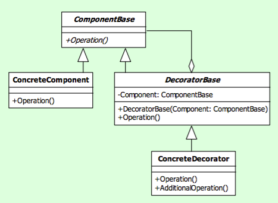
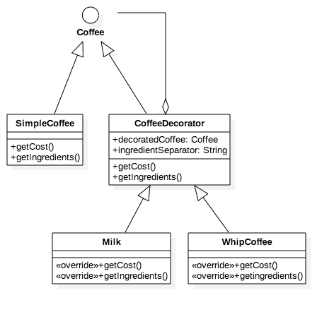

# 🍧 Decorator Design Pattern, in Swift 3.0

This is a Structural Design Pattern

Inspired on [github ochococo/Design-Patterns-In-Swift](https://github.com/ochococo/Design-Patterns-In-Swift#-decorator)

## Pattern Definition

The decorator pattern is used to extend or alter the functionality of objects at run- time by wrapping them in an object of a decorator class. This provides a flexible alternative to using inheritance to modify behaviour.

## Class Diagram

## Class Diagram for [Coffee Decorator example (@ochococo)](https://github.com/ochococo/Design-Patterns-In-Swift#-decorator)

## Decorator implementation in Java

I implemented a similiar Decorator in Java, based in [Design Patterns book by Head First](http://shop.oreilly.com/product/9780596007126.do). [github:adagio/Starbuzz](https://github.com/adagio/Starbuzz)
